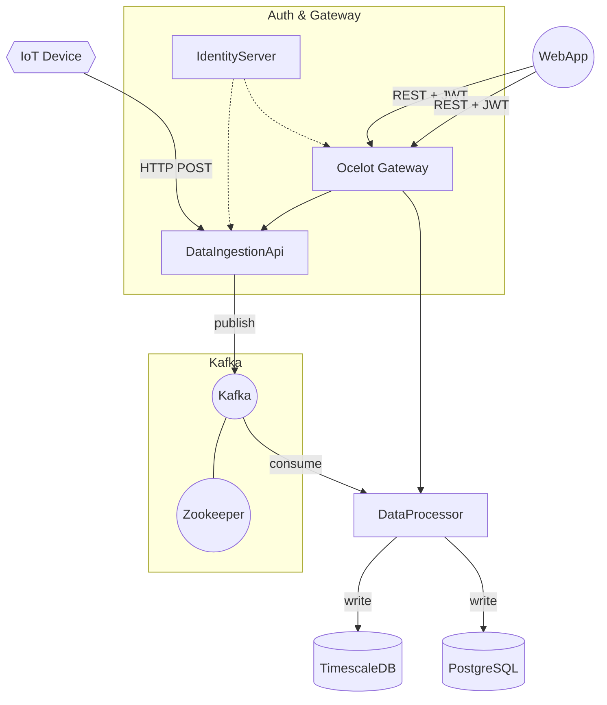

# MicroServiceIoT – MVP

Полноценный минимальный стек для приёма, обработки и визуализации данных IoT-устройств в режиме реального времени.

## 🔥 Состав

| Сервис | Технология | Назначение |
| ------ | ---------- | ---------- |
| IdentityServer | **Duende IdentityServer 6** (.NET 7) | JWT-аутентификация пользователей и устройств |
| ApiGateway | **Ocelot** (.NET 7) | Единая точка входа, проверка токена, прокси запросов |
| DataIngestionApi | **ASP.NET Core Web API** (.NET 7) | Приём данных устройств, публикация в Kafka |
| DataProcessor | **.NET Worker Service** | Консьюмер Kafka, валидация, запись в TimescaleDB/PostgreSQL |
| PostgreSQL + Timescale | образ `timescale/timescaledb` | Метаданные (PG) + временные ряды (Timescale) |
| Kafka + Zookeeper | образы Bitnami | Шина событий |
| DeviceApi | **ASP.NET Core Web API** (.NET 7) | REST-доступ к TimescaleDB (список устройств, данные) |
| DeviceSimulator | **.NET Console** | Отладочный генератор телеметрии |
| WebApp | **React 18** + Chakra UI + Tailwind + Chart.js | Дашборд (JWT-логин, графики, авто-обновление) |

Контейнеры собираются и запускаются единым `docker-compose`-файлом.

---

## 🚀 Быстрый старт

1. Установите **Docker** и **docker-compose** ⤵️  
   Windows – Docker Desktop, Linux/macOS – пакет `docker-compose`.
2. Клонируйте репозиторий:
   ```bash
   git clone https://github.com/your-org/MicroServiceIoT.git
   cd MicroServiceIoT
   ```
3. Запустите весь стек:
   ```bash
   docker-compose up --build
   ```
   При первом запуске будут собраны .NET и React-контейнеры, скачаны образы Timescale/Kafka.
4. Откройте:
   * Дашборд – http://localhost:3000  
     Логин: **admin** / **admin** (тест-пользователь).
   * Swagger DataIngestionApi – http://localhost:5000/swagger (только из Dev-сети)
   * IdentityServer – http://localhost:5001 (.well-known/openid-configuration)

> ⚠️ Порты можно переопределить в `docker-compose.yml`.

### Остановка
```bash
docker-compose down
```

---

## ⚙️ Конфигурация

*Все переменные задаются в `docker-compose.yml` и прокидываются как `ENV`.*

| Переменная | Где используется | Значение по умолчанию |
| ---------- | ---------------- | --------------------- |
| `POSTGRES_USER` / `POSTGRES_PASSWORD` | postgres | `user` / `pass` |
| `Kafka__BootstrapServers` | api, processor | `kafka:9092` |
| `IdentityUrl` | api, gateway | `http://identity` |
| `Database__TimescaleConnectionString` | processor | `Host=postgres;Database=iot;Username=user;Password=pass` |

---

## 🗺️ Архитектура контейнеров



---

## 📝 Folder Structure

<details>
<summary>Нажмите, чтобы открыть</summary>

```text
MicroServiceIoT/
├── DataIngestionApi/         # ASP.NET Core Web API (приём + Kafka producer)
│   ├── Controllers/
│   │   └── DataController.cs
│   ├── Services/
│   │   └── KafkaProducerService.cs
│   ├── Models/
│   │   └── SensorDataDto.cs
│   ├── Options/
│   │   └── KafkaOptions.cs
│   ├── Program.cs
│   └── Dockerfile
│
├── DataProcessor/            # .NET Worker Service (Kafka consumer)
│   ├── Workers/
│   │   └── SensorDataWorker.cs
│   ├── Models/
│   │   └── SensorDataDto.cs
│   ├── Options/
│   │   ├── KafkaOptions.cs
│   │   └── DatabaseOptions.cs
│   ├── Program.cs
│   └── Dockerfile
│
├── ApiGateway/               # Ocelot Gateway
│   ├── ocelot.json
│   ├── Program.cs
│   └── Dockerfile
│
├── IdentityServer/           # Duende IdentityServer
│   ├── Config.cs
│   ├── TestUsers.cs
│   ├── Program.cs
│   └── Dockerfile
│
├── DeviceApi/                # ASP.NET Core Web API (чтение из TimescaleDB)
│   ├── Controllers/
│   │   └── DevicesController.cs
│   ├── Repositories/
│   │   └── DeviceRepository.cs
│   └── Program.cs
│
├── DeviceSimulator/          # .NET console app (генератор данных)
│   └── Program.cs
│
├── WebApp/                   # React 18 + Chakra UI + Tailwind + Chart.js
│   ├── tailwind.config.cjs / postcss.config.cjs / index.css
│   ├── package.json
│   └── src/
│       └── …
│
├── docker-compose.yml        # единый запуск
├── README.md
└── StructureProgram.txt      # краткая структура проекта
```

</details>

---

## 📡 Инжест данных (пример cURL)

```bash
TOKEN=$(curl -s -X POST http://localhost:5001/connect/token \
 -d "client_id=webapp" -d "client_secret=webapp-secret" \
 -d "grant_type=password" -d "username=admin" -d "password=admin" \
 -d "scope=api" | jq -r .access_token)

curl -X POST http://localhost:5000/api/data \
 -H "Authorization: Bearer $TOKEN" \
 -H "Content-Type: application/json" \
 -d '{
  "deviceId": 1,
  "timestamp": "2025-01-01T00:00:00Z",
  "temperature": 22.7,
  "humidity": 40.2
}'
```

---

## 🏗️ Расширение

1. **Метаданные устройств** – добавьте сервис DeviceApi и таблицы в PostgreSQL.
2. **Alerts / Notifications** – создайте Worker, который читает TimescaleDB и отправляет нотификации.
3. **Мониторинг** – подключите `prometheus-net` и добавьте Prometheus + Grafana.
4. **Логирование** – добавьте Serilog sink в Elasticsearch.

---

Happy Hacking! 🎉

## 🐳 Docker Cheat-Sheet

| Команда | Что делает |
|---------|------------|
| `docker compose up --build` | Собрать образы (если нужно) и запустить **весь** стек в текущем терминале. |
| `docker compose up -d --build` | То же самое, но в фоне (`-d` = detached). |
| `docker compose up -d --build web deviceapi gateway` | Пересобрать **только** перечисленные сервисы (WebApp, DeviceApi, Gateway) и перезапустить их, остальные контейнеры не трогаются. Удобно после изменения фронта или маршрутов. |
| `docker compose restart gateway` | Мягко перезапустить один контейнер (без пересборки образа). |
| `docker compose logs -f --tail=100 gateway` | «Прилипнуть» к логам конкретного сервиса. |
| `docker compose exec postgres psql -U $POSTGRES_USER $POSTGRES_DB` | Открыть `psql` внутри контейнера БД. |
| `docker compose down` | Остановить и удалить все контейнеры сети/тома **без** потери данных. |
| `docker compose down -v` | То же + удалить тома (данные в Timescale/Postgres будут потеряны). |

> Все команды читают переменные из файла `.env` (или `compose.env`, если запускаете с `--env-file compose.env`).
